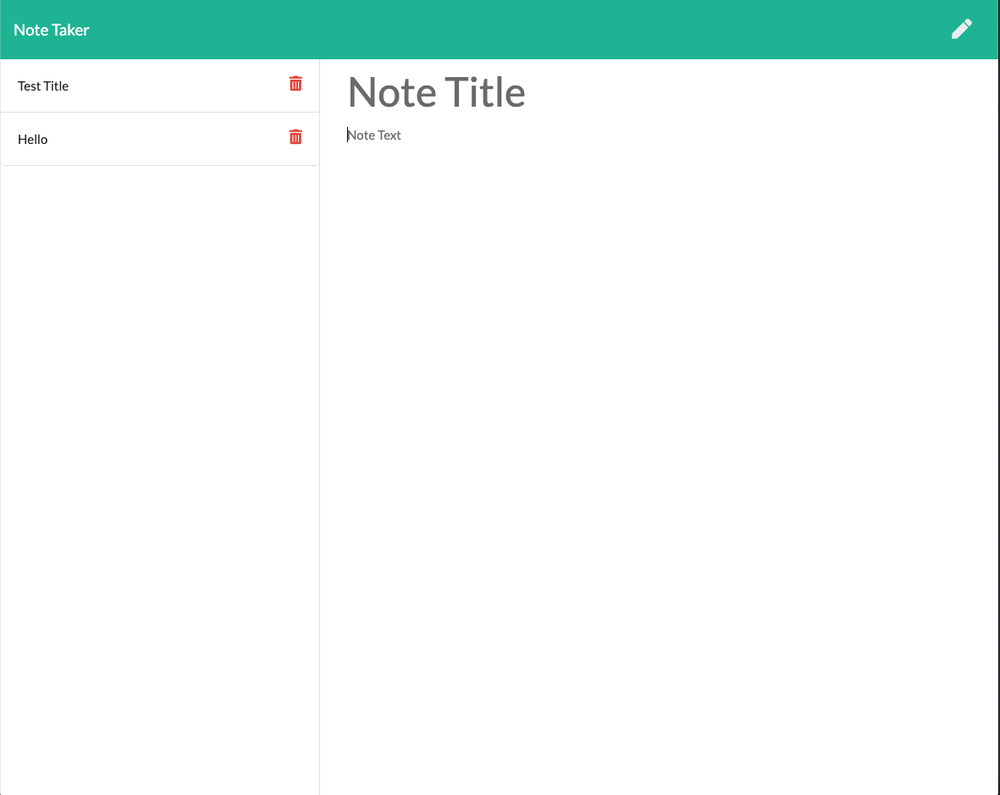

# Note Taker 

## Description
Note Taker is an online application that allows a user to jot down notes in a clean and organized way to improve task management and productivity. 

## Table of Contents
- [Installation](#Installation)
- [Usage](#Usage)
- [License](#License)

## Installation
Note Taker can be accessed by visiting clu-codes-note-taker.herokuapp.com or can be installed for personal modifications by forking or cloning from github.com/clu-codes/note-taker

## Usage
Note Taker is a lightweight, simple online note taking application that allows a user to quickly compile notes for task management and other organizational needs. Users are able to add, delete, and save notes as they please. 

## License
This application is under the MIT license.

## Image   

## Questions
Github: https://www.github.com/clu-codes
If you have additional questions, please feel free to reach out to me on Github or LinkedIn at https://www.linkedin.com/in/connor-cluster-24b661203/.